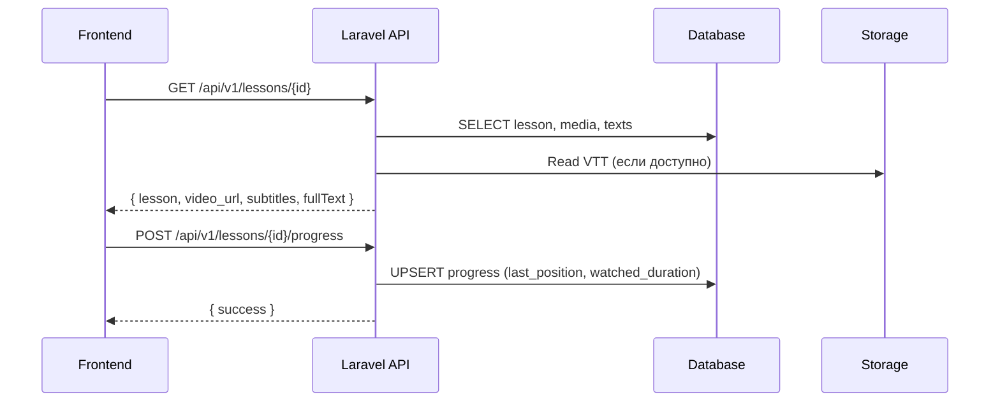

# Обзор кодовой базы (backend-laravel)

Этот документ описывает структуру проекта, ключевые файлы, взаимосвязи и основные точки расширения. Цель — быстрое погружение нового разработчика.

## Структура каталогов

- `app/`
  - `Http/Controllers/Api/` — контроллеры API (`AuthController`, `CourseController`, `ModuleController`, `LessonController`, `ProgressController`, `AdminController`)
  - `Http/Controllers/CareerTestController.php` — контроллер карьерных тестов
  - `Models/` — модели домена (`Course`, `Module`, `Lesson`, `LessonMedia`, `LessonText`, `Progress`, `Purchase`, `Career*`, `Certificate`, `Test`, `User`)
- `bootstrap/`, `config/`, `database/`, `routes/`, `resources/`, `storage/`, `public/` — стандартные каталоги Laravel

## Ключевые файлы и назначение

### Контроллеры (Api)

- `AuthController`
  - Назначение: регистрация, вход, выход, профиль пользователя через Sanctum
  - Взаимосвязи: `User` модель, middleware `auth:sanctum`
  - Ключевые методы: `register`, `login`, `logout`, `user`

- `CourseController`
  - Назначение: список курсов, детальная информация, зачисление (все курсы бесплатны), прогресс
  - Взаимосвязи: `Course`, `Lesson`, `Purchase`, `Progress`
  - Ключевые методы: `index`, `show`, `enrolled`, `enroll`, `getProgress`, `markLessonComplete`

- `ModuleController`
  - Назначение: CRUD для модулей курса (внутри `Course`)
  - Взаимосвязи: `Module`, `Course`, `Lesson`
  - Ключевые методы: ресурсные методы `index`, `show`, `store`, `update`, `destroy`

- `LessonController`
  - Назначение: выдача урока вместе с видео-URL и субтитрами; сохранение прогресса
  - Взаимосвязи: `Lesson`, `LessonMedia`, `LessonText`, `Progress`
  - Ключевые методы: `show`, `getSubtitles`, `saveProgress`, `saveSession`, `getProgress`
  - Примечание: генерирует субтитры из VTT-файла или из `LessonText` (разбивка на предложения, оценка длины), либо из поля `content` (legacy)

- `ProgressController`
  - Назначение: сбор, выдача и сводная статистика пользовательского прогресса по курсам и урокам
  - Взаимосвязи: `Progress`, `Course`, `Lesson`
  - Ключевые методы: `index`, `summary`, `store`, `update`, `courseStats`

- `AdminController`
  - Назначение: административные операции — управление курсами/модулями/уроками, загрузка медиа, статистика
  - Взаимосвязи: `Course`, `Module`, `Lesson`, `LessonMedia`, `Storage`
  - Ключевые методы: `getCourses`, `createCourse`, `updateCourse`, `deleteCourse`, `getModules`, `createModule`, `updateModule`, `deleteModule`, `reorderModules`, `toggleModulePublication`, `getLessons`, `createLesson`, `updateLesson`, `deleteLesson`, `reorderLessons`, `toggleLessonPublication`, `getStats`, `uploadVideo`, `upload3DModel`, `uploadSubtitles`

### Модели

- `Course`
  - Поля: `title`, `description`, `price`, `is_free`, `duration_hours`, `image`, `is_published`, и др.
  - Связи: `modules`, `purchases`

- `Module`
  - Поля: `course_id`, `title`, `description`, `order_index`, `is_published`
  - Связи: `course`, `lessons`

- `Lesson`
  - Поля: `module_id`, `title`, `content`, `video_url` (legacy), `gesture_data`, `is_published`
  - Связи: `module`, `texts`, `primaryText`, `media`, `defaultVideo`, `videos`, `subtitles`, `progress`

- `LessonMedia`
  - Поля: `lesson_id`, `type` (`video`, `subtitles`, `model`, `document`), `storage_path`, `url`, `captions`, `poster_url`, `is_default`
  - Методы: `getFullUrlAttribute()` — вычисляет полный URL (учитывает `asset('storage/...')`)

- `LessonText`
  - Назначение: текст урока (Markdown-текст или чистый), улучшение субтитров
  - Методы: `getSentences()` — разбиение на предложения и оценка длительности; `getFullText()` — полный текст

- `Progress`
  - Поля: `user_id`, `course_id`, `lesson_id`, `status`, `last_position_seconds`, `watched_duration_seconds`

- `Purchase`
  - Поля: `user_id`, `course_id`, `status`, `purchased_at`

- `CareerTest`, `CareerQuestion`, `CareerTestResult`
  - Назначение: структура и результаты карьерного тестирования

### Маршруты

- `routes/api.php`
  - Группа `v1` с Public и Protected маршрутами
  - Отдельные ручки для выдачи файлов из `storage` (`models`, `subtitles`, `videos`)
  - См. подробности в `docs/ROUTES.md`

### Конфигурации

- `config/filesystems.php` — настройка дисков (`local`, `public`, `s3`), симлинки
- `config/cors.php` — домены фронтенда (локальные, Vercel, ngrok), `supports_credentials`
- `config/sanctum.php` — stateful-домены, middleware

### Миграции и сиды

- `database/migrations` — таблицы: `courses`, `modules`, `lessons`, `lesson_texts`, `lesson_media`, `progress`, `purchases`, `career_*`, индексы
- `database/seeders` — начальные данные для курсов, модулей, уроков, карьерного теста

## Взаимозависимости (пример)

## Практические замечания

- Генерация `video_url`: приоритет `LessonMedia(type=video, is_default)` → первый `videos` → `lesson.video_url` (legacy). Для `legacy` путь нормализуется как `asset('storage/...')`.
- Субтитры: приоритет VTT из `LessonMedia(type=subtitles)` → `gesture_data['subtitles_url']` → генерация из `LessonText` → генерация из `content`.
- CORS: добавляйте домены фронта в `config/cors.php` и при необходимости в `SANCTUM_STATEFUL_DOMAINS`.

## Точки расширения

- Поддержка HLS/DASH и адаптивных качеств
- Автоматическое наполнение `LessonText` из транскриптов
- Расширение модели прогресса для попыток/сессий
- События/вебхуки для аналитики и сертификации

